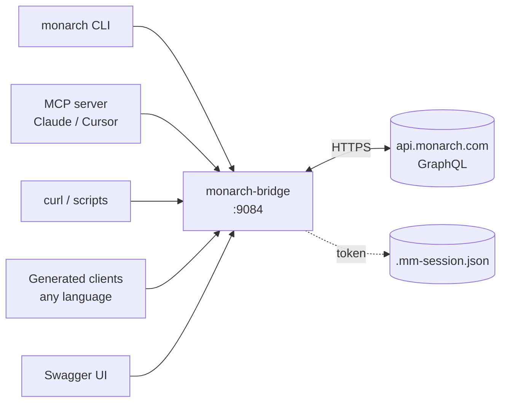

# monarch-bridge

[](https://github.com/nicholasklaene/monarch-bridge/actions/workflows/ci.yml)
[](LICENSE)


## Install in one command

Pick your preference. All install the same monarch-bridge running on `localhost:9084`:

| Platform | One-liner | What it does |
|---|---|---|
| Homebrew (mac) | `brew install nicholasklaene/monarch-bridge/monarch-bridge` | CLI + auto-start service via launchd |
| Docker (any) | `docker run -d -p 9084:9084 -v ~/.config/monarch-bridge:/var/monarch-bridge/session ghcr.io/nicholasklaene/monarch-bridge` | runs the bridge |
| Curl + bash | `curl -fsSL https://raw.githubusercontent.com/nicholasklaene/monarch-bridge/main/scripts/install.sh \| bash` | docker pull + CLI symlink + plist |
| Python client | `pip install monarch-bridge-client` | typed client lib for scripts (published with the v1.0.0 release) |
| TypeScript client | `npm install monarch-bridge-client` | typed client lib for Node / web (published with the v1.0.0 release) |

After install, one-time auth: run `monarch bootstrap` (see [Quick start](#quick-start)).

monarch-bridge is a local HTTP service that lets you read and write your [Monarch Money](https://www.monarchmoney.com) data from anywhere outside the web app.

Reach the same data from the tools you already use: an AI assistant (Claude Desktop, Cursor, Continue, Cline) via MCP, a terminal via the bundled `monarch` CLI, a script via `curl`, or a typed client generated from the OpenAPI spec in any language. Not a Monarch replacement; Monarch keeps owning your data and your web UI.

Runs on `localhost:9084`. Holds a session token in a local JSON file, forwards calls to `api.monarch.com`, returns Monarch's shape verbatim. No database, no events, no persistence. Binds to localhost-only by default; see [SECURITY.md](SECURITY.md) before exposing more broadly.

Status: v1.0.0, MIT-licensed, single maintainer.

## Architecture



## Why this exists

The Monarch web app is great for browsing. This bridge is for everything else.

Ask your AI assistant questions like:

- "What was my biggest spending category last month?"
- "Show me every transaction over $200 since May 1."
- "What's my net worth right now and how has it changed in the last 90 days?"
- "Did Netflix bill me twice this month?"

Or have it make changes for you:

- "Tag every Uber charge since May as Transportation."
- "Create a category called Home Improvement under the Bills group."

Other things you get:

- Bulk operations from a terminal (`monarch tx tags ...` over hundreds of rows in one shot).
- Pipe Monarch data through `jq` like any other JSON stream (`monarch accounts --raw | jq ...`).
- Build a dashboard or mobile app off the OpenAPI spec without scraping or undocumented endpoints.

It mirrors Monarch's GraphQL surface 1:1, so when Monarch surprises you, the bridge surprises you the same way. Every quirk is documented in [agents/context/AGENTS.md](agents/context/AGENTS.md).

## What it owns

- Session token cache (single JSON file, gitignored).
- Full Monarch GraphQL operation surface: accounts, transactions, tags, categories, category-groups CRUD, splits, budgets, recurring transactions + streams + aggregates, holdings, net worth, institutions, credit history, subscription, attachments + balance-history CSV uploads, credential delete, bulk transaction + account ops, transaction rules with preview, savings goals (with events / priorities / monthly-budget allocation), paychecks + employers, manual holdings, manual investments accounts, security search, merchants (search + delete + logo).
- 768 REST endpoints across 24 controllers, each implementing a spec-generated `*Api` interface.
- A bash CLI (`cli/monarch`) covering every endpoint, with confirmation prompts on destructive ops.
- A Model Context Protocol server (`mcp/`) so Claude Desktop, Cursor, Continue, and other MCP clients can call every endpoint as a tool, derived directly from the OpenAPI spec.
- A bootstrap CLI for one-time auth (`./gradlew :app:bootstrapMonarch`, run by hand; not auto-run).

## What it does NOT own

- No persistent database (Monarch is the source of truth).
- No event mesh (Monarch data doesn't change minute-to-minute).
- No per-source supersession or fact tables (Monarch handles dedup; this service is pure pass-through).
- No cross-account identity resolution or scope tagging (this is a personal Monarch bridge; downstream consumers handle their own categorization).
- No long-term storage of any kind (Monarch is the source of truth; we cache only the session token on disk).

## How it's built (spec-first)

`openapi/monarch-bridge.yaml` is the source of truth. The openapi-generator emits the `*Api` Spring interfaces and the request and response DTOs at build time; controllers implement those interfaces, so the spec and the code can never drift. The MCP server reads the same spec at startup to derive one MCP tool per operation, automatically. One source of truth, four consumer surfaces.

## Endpoints

Full endpoint reference, per-endpoint quirks, error codes, and PayloadError semantics
live in **[agents/context/AGENTS.md](agents/context/AGENTS.md)**, one file intended
for both AI agents and humans consuming this bridge.

Until the session JSON exists, every data endpoint returns `503` with
`{"code": "session_missing"}`. Run the bootstrap to fix.

## CLI

A thin bash wrapper lives at `cli/monarch`. Install:

```bash
ln -sf "$(pwd)/cli/monarch" ~/bin/monarch
monarch help                                            # full reference
```

This is the **curated** CLI: ~67 ergonomic subcommands over the operations you reach for daily, with friendly flags, confirmation prompts on destructive ops, and `jq`-formatted output. Shared helpers (`call`, `emit`, `fmt_table`, `parse_flags`, ...) live in `cli/monarch-lib.sh` so any other bash script can source them and talk to the bridge without re-implementing HTTP plumbing.

If you need shell access to an operation the curated CLI doesn't wrap, use the **generated** bash client at `clients/bash/monarch-api` (one subcommand per operationId, full 768/768 coverage; requires bash 4.3+). See [clients/bash/README.md](clients/bash/README.md).

### Reads
```bash
monarch health
monarch accounts
monarch transactions --start 2026-05-01 --limit 20
monarch networth --start 2026-01-01
monarch networth by-type --timeframe month
monarch holdings <account-id>
```

### Writes (destructive ops require `--yes` or `YES=1`)
```bash
monarch tx update <txn-id> --category <cat-id> --notes "rehab notes"
monarch tx tags <txn-id> <tag-id-1>,<tag-id-2>           # empty CSV = remove all
monarch tx delete <txn-id> --yes
monarch account update <id> --name "Renamed account"
monarch tag create "Business" --color "#19D2A5"
monarch category create "Home-improvement" --group <group-id>
```

See [cli/README.md](cli/README.md) for the full curated subcommand reference and the short list of operations the curated CLI doesn't wrap.

## Quick start

If you installed via Homebrew / Docker / curl above, the `monarch` CLI is already on
your PATH. Do the one-time auth with the bundled subcommand:

```bash
monarch bootstrap                      # interactive Monarch auth (email / password / MFA), runs in Docker
monarch health                         # verify
```

`monarch bootstrap` runs the interactive auth flow in a Docker container and writes the
session to `~/.config/monarch-bridge/.mm-session.json`.

### From a clone

If you cloned the repo instead, the setup script does the whole loop:

```bash
./scripts/setup.sh
```

Walks you through prereqs check, build, interactive Monarch auth, docker up,
health + auth verification, and installs the `monarch` CLI symlink. Prints a
"next steps" panel with copy-pasteable commands at the end.

Requires: docker, jq, JDK 21 (for the one-time bootstrap; docker handles runtime).

### Manual setup

If you'd rather drive each step yourself:

```bash
./gradlew :app:check                   # build (JDK 21)
./gradlew :app:bootstrapMonarch        # interactive auth (email / password / MFA)
                                       # → writes ~/.config/monarch-bridge/.mm-session.json
docker compose up -d                   # start the bridge on :9084
curl http://localhost:9084/healthz     # verify
ln -sf "$(pwd)/cli/monarch" ~/bin/monarch  # install the CLI
```

Non-interactive bootstrap (CI / re-auth): pass a TOTP secret instead of a code at the prompt.

```bash
./gradlew :app:bootstrapMonarch --args='--mfa-secret=JBSWY3DPEHPK3PXP...'
```

## Consume the API

The spec at `openapi/monarch-bridge.yaml` is the source of truth. Every consumer surface is either spec-generated or spec-derived, which means the same 768 operations are reachable from every direction. Pick by use case, not by completeness.

### Parity matrix

| Surface | Coverage | Best for |
|---|---|---|
| HTTP / `curl` (`http://localhost:9084/v1/*`) | 768 / 768 | Scripts, debugging, ad-hoc probing |
| Swagger UI (`http://localhost:9084/docs`) | 768 / 768 | Interactive exploration ("Try it out") |
| MCP server (`mcp/`) | 768 / 768 (auto-derived at startup) | AI assistants: Claude Desktop, Cursor, Continue, Cline |
| Generated typed clients (`clients/{python,kotlin,typescript}/`) | 768 / 768 (one-time generation) | Apps in Python, Kotlin, TypeScript |
| Generated bash client (`clients/bash/monarch-api`) | 768 / 768 (one-time generation) | Shell parity for the entire surface (bash 4.3+) |
| Curated `cli/monarch` | ~67 ergonomic subcommands | Daily power-user shell: friendly flags, formatted output, confirmation prompts |

`cli/monarch` is the daily driver; everything else is for cases it doesn't cover (a language other than bash, an AI assistant, an unwrapped endpoint, an HTTP-level probe). See [cli/README.md](cli/README.md) for the short list of operations the curated CLI doesn't wrap.

### Generate a client from the OpenAPI spec

```bash
# Kotlin
npx @openapitools/openapi-generator-cli generate \
  -i openapi/monarch-bridge.yaml -g kotlin -o clients/kotlin

# Python
npx @openapitools/openapi-generator-cli generate \
  -i openapi/monarch-bridge.yaml -g python -o clients/python

# TypeScript (axios)
npx @openapitools/openapi-generator-cli generate \
  -i openapi/monarch-bridge.yaml -g typescript-axios -o clients/typescript

# Bash (pinned to 2.20.5; the bash generator was removed in 7.x)
npx @openapitools/openapi-generator-cli@2.20.5 generate \
  -i openapi/monarch-bridge.yaml -g bash -o clients/bash \
  --additional-properties scriptName=monarch-api
```

Full list of supported generators: `npx @openapitools/openapi-generator-cli list`.

### Sample generated clients

`clients/` holds four pre-generated client trees (Python, TypeScript, Kotlin, bash) as a showcase. They are not hand-edited; the Python and TypeScript trees are published as `monarch-bridge-client` on PyPI and npm with the v1.0.0 release (a manual step on tagging, not yet live). Treat them as a reference for what consumers get for free. Each subdir has a generator-produced `README.md` (or `README-generated.md`) that documents every endpoint and DTO. See [clients/README.md](clients/README.md) for layout and per-language regen commands.

### Generate a subset client

The full surface is large. If your consumer only needs a few tags, pass `--global-property apis=Tag1,Tag2` and the generator emits only those operations plus their reachable schemas. The result is dramatically smaller.

Tags currently in the spec:

| Tag | What it covers |
|---|---|
| `System` | Health, auth, refresh, subscription, credit history |
| `Accounts` | Linked + manual account CRUD, history, holdings, networth |
| `Transactions` | Transaction CRUD, splits, tags, cashflow, summaries |
| `Budgets` | Monthly + flex bucket budgets, rollover settings |
| `Recurring` | Upcoming recurring transactions + merchant recurrence rules |
| `Categories` | Transaction category CRUD + category-groups read |
| `Tags` | Transaction-tag CRUD |
| `Goals` | Savings goals (v2): list, create, contribute, archive |
| `Rules` | Transaction rules CRUD + preview + bulk |
| `Merchants` | Merchant search + delete + logo |
| `Paychecks` | Paychecks + paycheck employers |
| `Holdings` | Holdings + portfolio allocation views |

Common subset recipes:

```bash
# Mobile app: accounts + transactions browsing
npx @openapitools/openapi-generator-cli generate \
  -i openapi/monarch-bridge.yaml -g typescript-axios -o clients/mobile-ts \
  --global-property apis=Accounts,Transactions,Categories,Tags

# Reporting / dashboard tool: read-only money views
npx @openapitools/openapi-generator-cli generate \
  -i openapi/monarch-bridge.yaml -g python -o clients/reporting-py \
  --global-property apis=Accounts,Transactions,Budgets,Holdings \
  --additional-properties packageName=monarch_reporting

# Automation: rules + bulk transaction ops
npx @openapitools/openapi-generator-cli generate \
  -i openapi/monarch-bridge.yaml -g kotlin -o clients/automation-kt \
  --global-property apis=Transactions,Rules,Tags,Categories \
  --additional-properties packageName=com.example.monarchauto

# AI assistant / full surface: omit the flag entirely (default = all tags)
```

To also keep only the schemas reachable from those tags (instead of all schemas in the spec), add `models=true` to the same `--global-property` value (e.g. `--global-property apis=Accounts,Transactions,models=true`).

## Re-auth

Sessions last several months but eventually expire. When endpoints start returning `401 session_expired`:

1. Re-run `./gradlew :app:bootstrapMonarch`.
2. `POST http://localhost:9084/v1/auth/refresh` to make the live service pick up the new session (no restart needed).

## Deployment

Local: `docker compose up -d` from this repo. The session JSON file is bind-mounted into the container, so bootstrap once on the host.

## Going deeper

- [docs/COOKBOOK.md](docs/COOKBOOK.md) - copy-pasteable recipes for common tasks (tag every Uber charge, daily spend digest, receipt upload, weekly recap to Slack, etc.).
- [docs/PATTERNS.md](docs/PATTERNS.md) - code + test patterns the project follows (one-source-of-truth spec, companion-factory mappers, what makes a test worth writing).
- [docs/HLD.md](docs/HLD.md) - high-level design (why no DB, why pass-through, what state actually lives where).
- [agents/context/AGENTS.md](agents/context/AGENTS.md) - per-endpoint reference for every operation: parameters, response shape, per-endpoint quirks.
- [agents/context/ARCHITECTURE.md](agents/context/ARCHITECTURE.md) - package layout + design rationale.
- [CONTRIBUTING.md](CONTRIBUTING.md) - spec-first add-an-endpoint walkthrough.

## License

See [LICENSE](LICENSE).

---

Not affiliated with or endorsed by Monarch Money, Inc.
